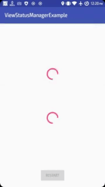

# ViewStatusManager

      

ViewStatus manager is a tool used to ease the process of adding and managing a ProgressView (feedback) when loading information to a view.

Fully supports `ConstraintLayout`



## Getting Started

These instructions will get you a copy of the library up and running on your local machine for development and testing purposes.

### Prerequisites

Add the JitPack repository to your build file.
Add it in your root build.gradle at the end of repositories

```gradle
allprojects {
    repositories {
        ...
        maven { url 'https://jitpack.io' }
    }
}
```

## 💾 Installation 

Add the dependency to the project's build.gradle file

```gradle
dependencies {
    ...
    
    implementation 'com.github.forntoh:ViewStatusManager-Android:0.4.0'
    
    ...
}
```

End with an example of getting some data out of the system or using it for a little demo

## ▶️ Usage 

The class `StatusManager` serves as entry point. Create a `StatusManager` with the corresponding builder class.

Before you can use the `StatusManager` you must initialize the object. You need to provide a parent `View` after that.

```java
StatusManager statusManager = StatusManager.from(findViewById(R.id.parent));
```

To change the status of a view, call the method `setStatus(@ResId int id, Status status)` while providing the id of the target view and the desired status.

```java
statusManager.setStatus(R.id.target, Status.PROGRESS);
```

#### ⚙ Possible status values
* `Status.PROGRESS` - Show a progress bar
* `Status.EMPTY` - No data to display in view (Empty response)
* `Status.FAILURE` - Error occurred
* `Status.SUCCESS` - Job completed with no error

## Versioning

We use [SemVer](http://semver.org/) for versioning. For the versions available, see the [tags on this repository](https://github.com/forntoh/ViewStatusManager-Android/tags). 

## 👨‍💻 Authors

**Forntoh Thomas**

## License

This project is licensed under the GNU Lesser General Public License v3.0 - see the [LICENSE.md](LICENSE.md) file for details